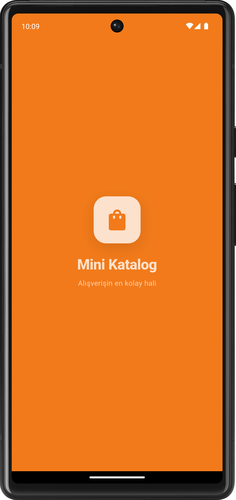
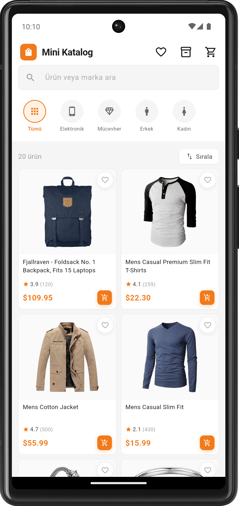
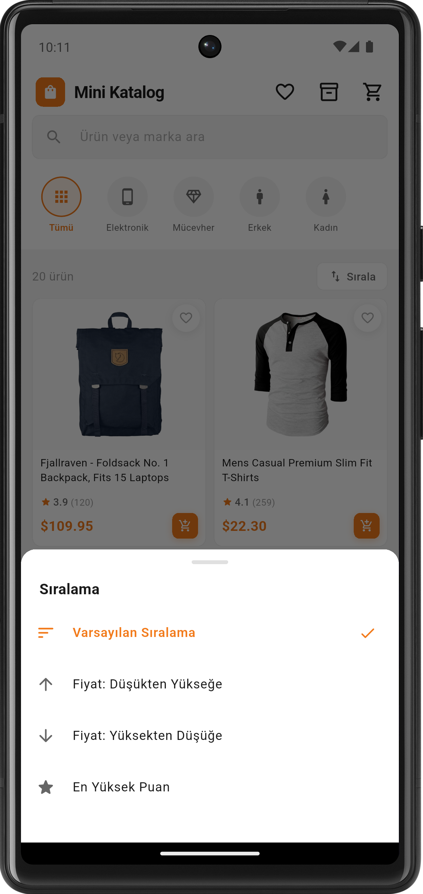
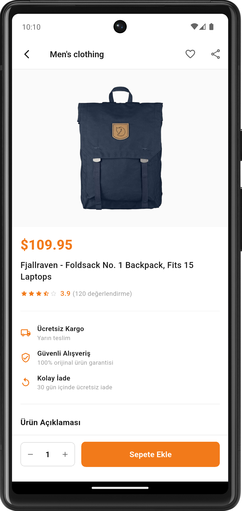
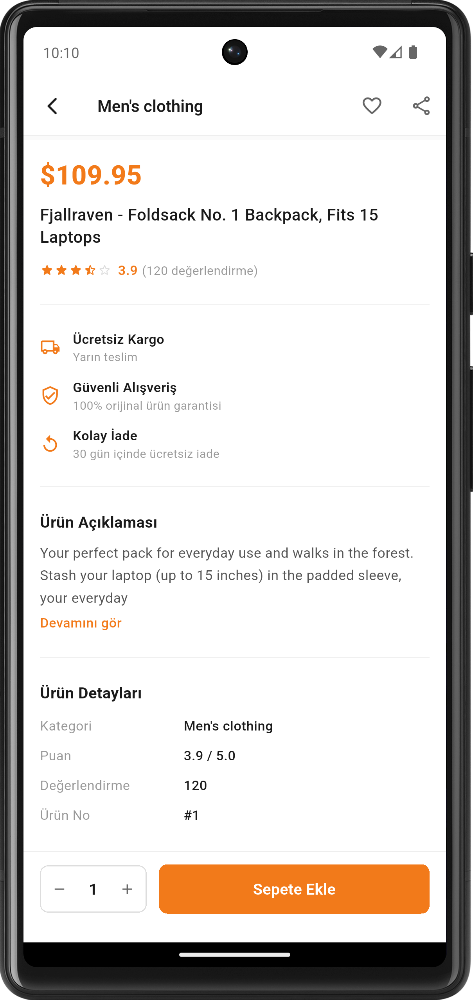
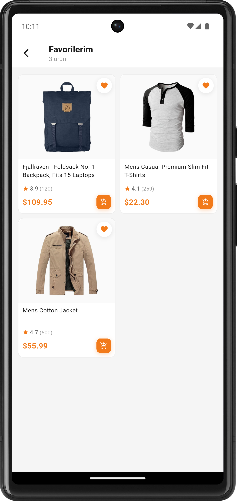
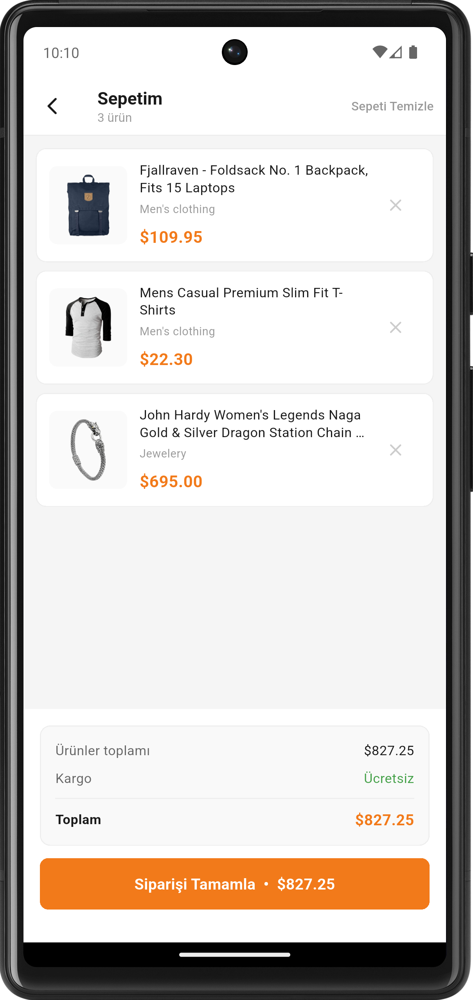
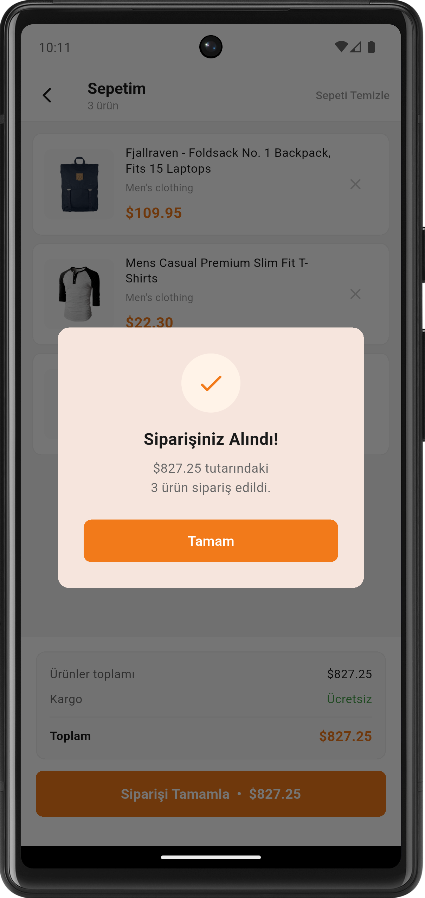
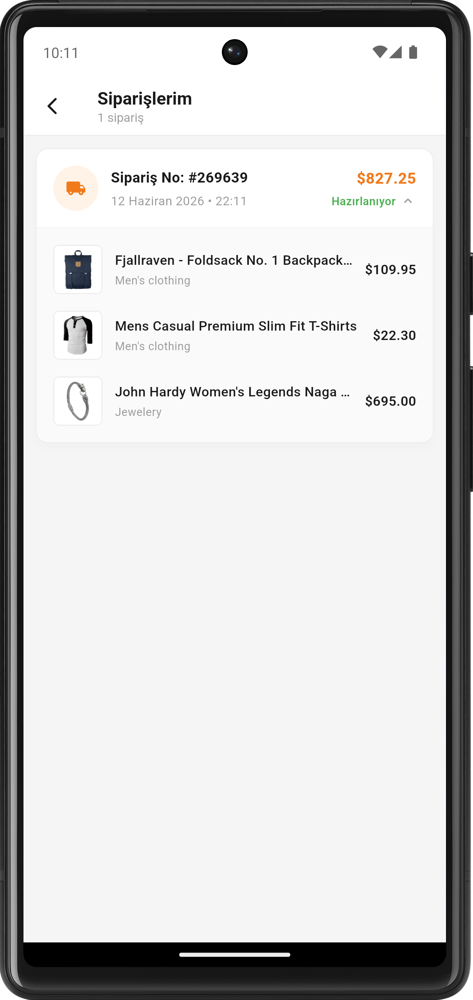

# Mini Katalog Uygulaması

<p align="center">
  
  
  
  
  
</p>

---

## 📱 Hakkında

**Mini Katalog Uygulaması**, [FakeStore API](https://fakestoreapi.com/) üzerinden gerçek zamanlı ürün verisi çeken, modern ve kullanışlı bir Flutter e-ticaret katalog uygulamasıdır. Yalnızca `material.dart` kütüphanesi kullanılarak geliştirilmiştir.

---

## 📸 Ekran Görüntüleri

| Açılış Ekranı (Splash) | Ana Sayfa | Sıralama Seçenekleri |
|:---:|:---:|:---:|
|  |  |  |

| Ürün Detayı (Üst Bölüm) | Ürün Detayı (Alt Bölüm) | Favorilerim |
|:---:|:---:|:---:|
|  |  |  |

| Sepetim | Sipariş Onayı | Siparişlerim |
|:---:|:---:|:---:|
|  |  |  |

---

## ✨ Özellikler

| Özellik | Açıklama |
|---------|----------|
| 🏠 **Ana Sayfa** | Ürün grid görünümü, kategori filtreleme, arama |
| 🔍 **Arama** | Anlık ürün ve kategori araması |
| 📂 **Kategori Filtresi** | Tümü / Elektronik / Mücevher / Erkek / Kadın |
| ↕️ **Sıralama** | Varsayılan / Fiyat ↑ / Fiyat ↓ / En Yüksek Puan |
| ❤️ **Favoriler** | Ürünleri favorilere ekle/çıkar, ayrı ekranda listele |
| 🛒 **Sepet** | Ürün ekleme/çıkarma, toplam hesaplama, sipariş tamamlama |
| 📦 **Siparişlerim** | Geçmiş sipariş numaralarını, tarihlerini ve detaylarını listeleme (Açılır-kapanır kartlarla) |
| 📄 **Ürün Detay** | Görseller, açıklama, puan, kargo bilgisi, adet seçimi |
| 🎬 **Splash Screen** | Animasyonlu uygulama açılış ekranı |
| 🔄 **Pull to Refresh** | Ürünleri yenilemek için aşağı çekme |

---

## 🏗️ Proje Yapısı

```
lib/
├── main.dart                      # Uygulama giriş noktası & rota yönetimi
├── models/
│   └── product.dart               # Ürün veri modeli
├── data/
│   └── product_repository.dart    # API iletişim katmanı
├── screens/
│   ├── splash_screen.dart         # Açılış ekranı
│   ├── home_screen.dart           # Ana sayfa (liste, arama, filtre, sıralama)
│   ├── product_detail_screen.dart # Ürün detay sayfası
│   ├── cart_screen.dart           # Sepet sayfası
│   └── favorites_screen.dart      # Favoriler sayfası
└── widgets/
    ├── product_card.dart          # Yeniden kullanılabilir ürün kartı
    └── banner_widget.dart         # Yardımcı banner bileşeni
```

---

## 🛠️ Teknik Detaylar

- **Framework:** Flutter 3.44.1
- **Dil:** Dart 3.x
- **API:** [FakeStore API](https://fakestoreapi.com/) — `https://fakestoreapi.com/products`
- **HTTP:** `dart:io` `HttpClient` (ekstra paket kullanılmamıştır)
- **State Management:** `StatefulWidget` + `setState`
- **Platform:** Android (API 34 — Android 14 test edildi) · iOS (Mac + Xcode gerektirir)

### Kullanılan Paketler
> Proje tamamen **Flutter Material** kütüphanesi ile geliştirilmiştir. Ekstra paket kullanılmamıştır.

```yaml
dependencies:
  flutter:
    sdk: flutter
```

---

## 📡 API — FakeStore API

Bu uygulama ücretsiz ve kayıt gerektirmeyen **[FakeStore API](https://fakestoreapi.com/)** ile çalışmaktadır.  
Tüm ürün verisi, kategoriler ve puanlamalar bu API'den gerçek zamanlı olarak çekilmektedir.  
HTTP isteği için ekstra bir paket kullanılmamış; Dart'ın yerleşik `dart:io` kütüphanesindeki `HttpClient` tercih edilmiştir.

### Kullanılan Endpointler

| Method | Endpoint | Kullanım Amacı |
|--------|----------|----------------|
| `GET` | `/products` | Tüm ürün listesi — ana sayfa grid'ini doldurur |
| `GET` | `/products/categories` | Kategori listesi — filtreleme çubuğunu oluşturur |

### API Yanıt Yapısı

`GET /products` isteğine dönen her ürün nesnesi aşağıdaki alanlardan oluşur:

```json
{
  "id": 1,
  "title": "Fjallraven - Foldsack No. 1 Backpack",
  "price": 109.95,
  "description": "Your perfect pack for everyday use...",
  "category": "men's clothing",
  "image": "https://fakestoreapi.com/img/81fAn0X5zhL._AC_UL640_FMwebp_QL65_.jpg",
  "rating": {
    "rate": 3.9,
    "count": 120
  }
}
```

### Verinin Uygulamada Kullanımı

| API Alanı | Uygulamada Nerede? |
|-----------|-------------------|
| `id` | Favori takibi (`Set<int>`) ve sepet anahtarı |
| `title` | Ürün adı — kart ve detay ekranı |
| `price` | Fiyat gösterimi ve sepet toplamı hesabı |
| `description` | Detay ekranında genişletilebilir açıklama |
| `category` | Kategori filtresi ve AppBar başlığı |
| `image` | `Image.network()` ile ürün görseli |
| `rating.rate` | Yıldız gösterimi ve sıralama (en yüksek puan) |
| `rating.count` | Değerlendirme sayısı gösterimi |

---

## 🚀 Kurulum & Çalıştırma

### Genel Gereksinimler
- Flutter SDK **3.x** veya üzeri
- İnternet bağlantısı (FakeStore API için)

### Adımlar

```bash
# 1. Projeyi klonla
git clone https://github.com/KULLANICI_ADIN/Mini_Katalog_Uygulamasi.git
cd mini_katalog

# 2. Bağımlılıkları yükle
flutter pub get

# 3. Bağlı cihaz veya emülatörde çalıştır
flutter run
```

---

### 🤖 Android

**Gereksinimler:** Android Studio · Android SDK · Android cihaz veya emülatör (API 21+)

```bash
# Debug modda çalıştır
flutter run -d emulator-5554

# Release APK oluştur
flutter build apk --release
# Çıktı: build/app/outputs/flutter-apk/app-release.apk
```

---

### 🍎 iOS

> **Önemli:** iOS derlemesi yalnızca **macOS** üzerinde yapılabilir.  
> Apple, Xcode'u yalnızca Mac için sunduğundan Windows veya Linux'ta iOS build alınamaz.

**Gereksinimler:**
- macOS işletim sistemi
- [Xcode](https://developer.apple.com/xcode/) (App Store'dan ücretsiz)
- iOS Simulator (Xcode ile birlikte gelir) veya fiziksel iPhone/iPad
- *(App Store'a yüklemek için)* Ücretli Apple Developer hesabı

```bash
# Bağımlılıkları kur (Mac terminalinde)
flutter pub get
cd ios && pod install && cd ..

# iOS Simulator'da çalıştır
flutter run -d iPhone

# Release IPA oluştur
flutter build ipa --release
```

> **Not:** Bu projedeki `ios/` klasörü Flutter tarafından otomatik oluşturulmuştur.  
> Uygulama kodu `lib/` içinde platform bağımsız Dart ile yazıldığından,  
> Mac ortamında `flutter run` komutu ile doğrudan iOS'ta çalışabilir.

---

## 📁 Ekstra Notlar

- `android/gradle.properties` içinde `android.overridePathCheck=true` ayarı, Türkçe karakterli klasör yollarında oluşan Gradle hatasını çözmek için eklenmiştir.
- Uygulama HTTP trafiğine izin vermek için `AndroidManifest.xml`'de `usesCleartextTraffic="true"` aktif edilmiştir.

---

## 👨‍💻 Geliştirici

**Furkan Artan**  
Flutter · Dart · Mobil Uygulama Geliştirme
